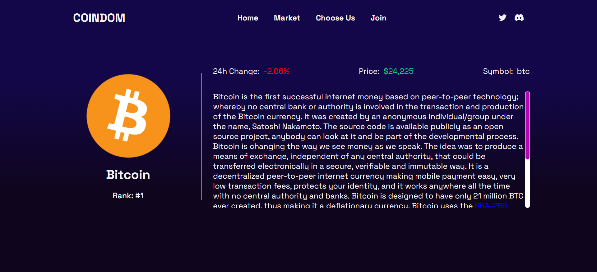

<h1>Crypto-Tracker-App</h1>
 
<h2>Screenshots of the Project 📸</h2>
 
<h3 align='center'>Home Page 🏡</h3>

  
<h3 align='center'>Coin Page 👇</h3>

 
 

# Crypto-Tracker-APP Project

This project is a simple web application built using React.js that allows users to track cryptocurrency market updates. It fetches data from the CoinGecko API and displays information such as current prices, 24-hour price changes, and market capitalization for the top cryptocurrencies.

## Project Structure

The project is structured as follows:

- **Pages**: Contains different pages of the website. Each page is a React component responsible for rendering specific content.
  - `HomePage`: Renders the homepage content.It fetches data from the CoinGecko API and displays information such as current prices, 24-hour price changes, and market capitalization for the top cryptocurrencies.
  - `CoinPage`: Renders information on every coin such as current price, 24-hour price change, market capitalization and its description..

## Routing

The application uses `react-router-dom` for routing. Different routes are defined for each page, and corresponding components are rendered based on the URL.

## Usage

To run the project locally:

1. Clone the repository.
2. Install dependencies using `npm install`.
3. Start the development server using `npm start`.

## Technologies Used

- React: A JavaScript library for building user interfaces.
- react-router-dom: DOM bindings for React Router, used for routing in the application.

## Contributing

Contributions are welcome! If you'd like to contribute to this project, please fork the repository and submit a pull request with your changes.

## License

This project is licensed under the MIT License - see the [LICENSE](./LICENSE) file for details.
